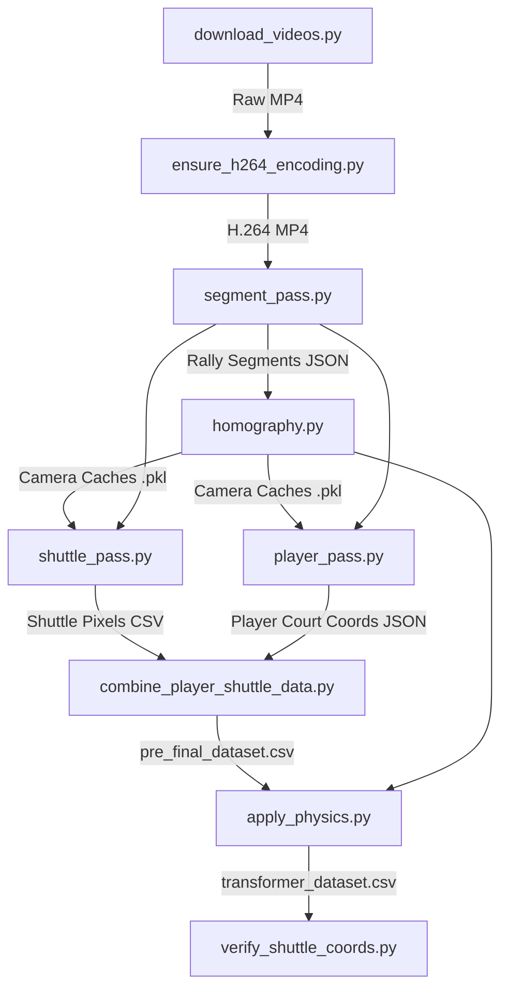

# Dataset Creation Pipeline

This directory contains the end-to-end pipeline for transforming raw badminton match videos into a high-fidelity 3D trajectory dataset suitable for training Transformer models (`tranSPORTmer`).

## 🛠 Directory Overview

The pipeline progresses from raw video acquisition to 3D physics-refined coordinate extraction. It involves computer vision (TrackNet, YOLO), camera calibration (Homography, PnP), and physical modeling (BVP solvers).

### Execution Order & Data Flow

## 📄 File Summaries

| Order | File | Description | Output |
| :--- | :--- | :--- | :--- |
| 1 | `download_videos.py` | Fetches badminton matches from YouTube. | `dataset/videos/*.mp4` |
| 2 | `ensure_h264_encoding.py` | Transcodes videos to H.264 to ensure frame-accurate seeking. | Re-encoded `.mp4` |
| 3 | `segment_pass.py` | Uses SACNN to detect active rally segments (start/end frames). | `outputs/segments/*.json` |
| 4 | `homography.py` | Interactive tool to click court corners and posts for camera calibration. | `homography_cache.pkl`, `camera_pose_cache.pkl` |
| 5 | `shuttle_pass.py` | Orchestrates TrackNetV3 to extract shuttle pixel coordinates per segment. | `outputs/shuttle_tracks/.../ball.csv` |
| 6 | `player_pass.py` | Detects players via YOLOv8 and projects them to 2D court meters. | `outputs/player_tracks/*.json` |
| 7 | `combine_player_shuttle_data.py` | Merges shuttle/player data and detects hit frames. | `pre_final_dataset.csv` |
| 8 | `apply_physics.py` | **The Core:** Projects pixels to 3D meters and applies drag/gravity models. | `transformer_dataset.csv` |
| 9 | `verify_shuttle_coords.py` | Visualization tool to check for coordinate sanity (Z > 0, court bounds). | Diagnostic Plots |

## 🚀 Detailed Workflow

1.  **Segmentation**: We don't process entire 2-hour videos. `segment_pass.py` identifies the ~20-30 second rallies.
2.  **Calibration**: `homography.py` is critical. By clicking the 4 court corners and 2 net posts, we compute the Camera Intrinsic/Extrinsic matrices and the Homography matrix ($H$).
3.  **Coordinate Projection**:
    *   **Players**: Projected directly onto the $Z=0$ plane using $H$.
    *   **Shuttle**: Since the shuttle is in the air ($Z > 0$), $H$ alone isn't enough. `apply_physics.py` uses the camera pose to back-project 2D pixels into 3D rays and solves for the most likely physical trajectory.
4.  **Physics Refinement**: `apply_physics.py` uses a Boundary Value Problem (BVP) solver with a physics model (gravity + air drag) to fill in missing TrackNet detections and ensure the shuttle follows a parabolic-like arc.

## ⚠️ Notes
*   `stroke_detection_pass[demoted].py`: An older version of hit detection that was replaced by the velocity-change logic in `combine_player_shuttle_data.py`.
*   Ensure `TrackNetV3` is available in the parent directory as it is called as a submodule.
