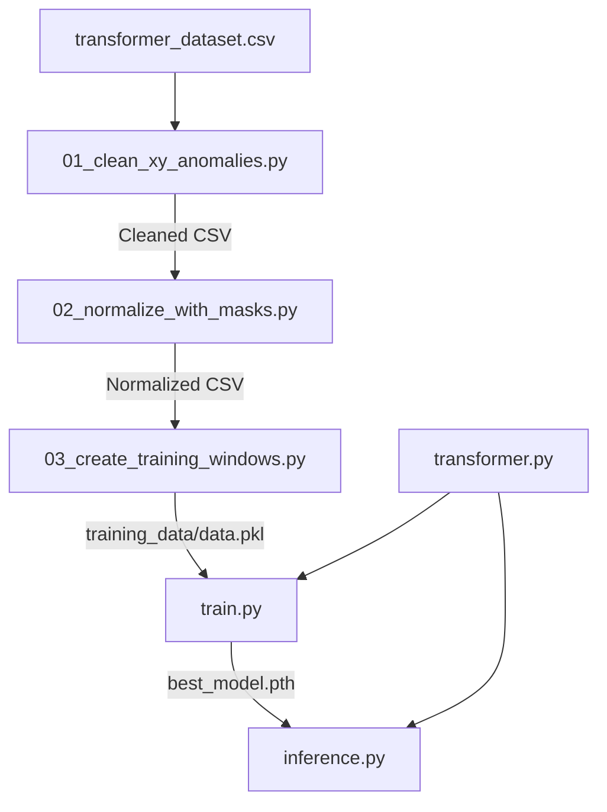

# TranSPORTmer: Trajectory Transformer

The core predictive engine of the project. **TranSPORTmer** is a Transformer-based architecture designed to predict future shuttlecock trajectories and opponent movement patterns based on historical rally data.

## 🛠 Role in Project
While TrackNet identifies *where the shuttle is*, TranSPORTmer predicts *where the shuttle will go*. It ingests the physics-refined coordinates and models the complex temporal dependencies of a badminton rally.

## 📊 Execution Order & Data Flow

## 📄 File Summaries

| Order | File | Description | Output |
| :--- | :--- | :--- | :--- |
| 1 | `01_clean_xy_anomalies.py` | Detects and handles scattered XY outliers in shuttle tracks. | `...cleaned.csv` |
| 2 | `02_normalize_with_masks.py` | Scales coordinates to [0, 1] and creates binary masks for NaN frames. | `...normalized.csv` |
| 3 | `03_create_training_windows.py` | Chunks long rallies into fixed-length windows (e.g., 125 frames). | `training_data/*.pkl` |
| 4 | `transformer.py` | Defines the PyTorch Transformer architecture (Enc-Dec). | Model Class |
| 5 | `train.py` | The main training loop with validation and checkpointing. | `best_TranSPORTmer_weights.pth` |
| 6 | `inference.py` | **Two Modes:** Next-shot prediction and Post-hit movement prediction. | Trajectory Forecasts |

## 🚀 Two Modes of Inference
1.  **Next-Shot Trajectory Prediction**:
    *   **Input**: Player movement + shuttle history up to the current hit frame.
    *   **Output**: The 3D profile of the upcoming flight path and landing zone.
2.  **Post-Hit Player Movement**:
    *   **Input**: Current rally state + the flight path of a just-hit shuttle.
    *   **Output**: Predicting where the opponent will move to prepare for their next shot.

## 📈 Performance Tracking
*   **`normalization_stats.json`**: Stores min/max bounds for consistent de-normalization.
*   **`test results.png`**: Visual comparison of ground truth vs. Transformer predictions.
*   **`thesis_results.json`**: Final metrics (MSE, MAE, Landing Zone Accuracy).
